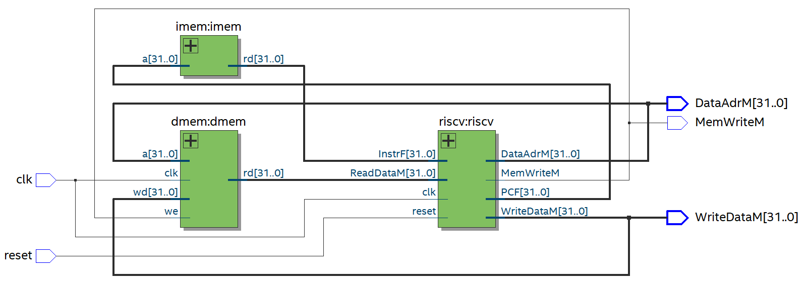
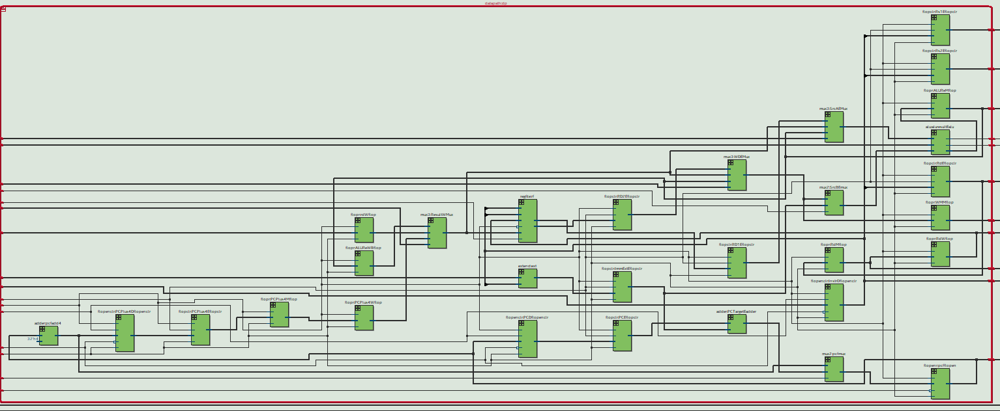
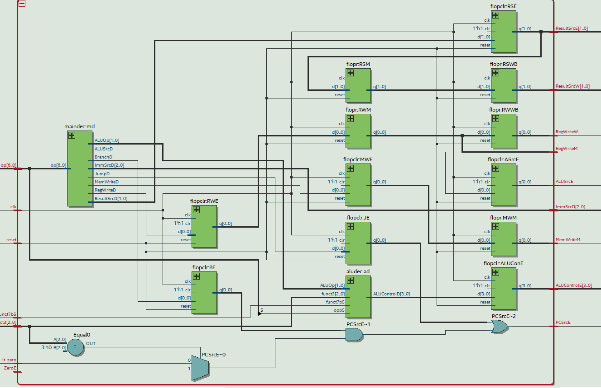
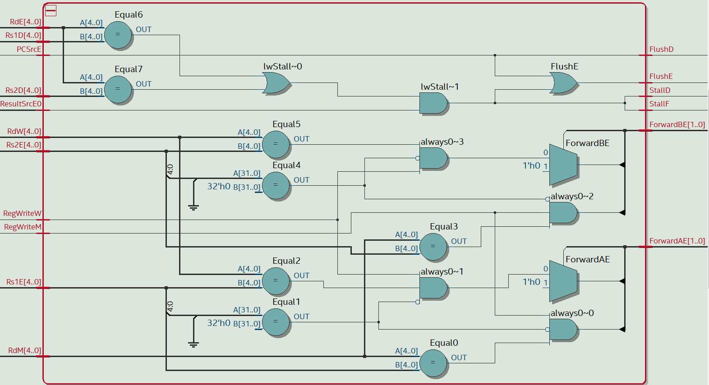

# RISCV-Pipelined-Processor-with-Hazard-Unit  
## Overview
This project demonstrates the design and implementation of a RISCV processor with a 5-stage pipeline. The processor supports basic instruction execution while addressing common pipeline hazards using hazard detection and forwarding, stalling, and flushing mechanisms.  

  

## Supported Instructions:  
<ins>Table 1: Main Decoder Truth Table with LUI instruction</ins>
  

<ins>Table 2: ALU Decoder Truth Table with LUI instruction</ins>  
  

## Pipeline Stages
1. **Instruction Fetch (IF)**: the processor reads the instruction from instruction memory
2. **Instruction Decode (ID)**: the processor reads the source operands from the register file and decodes the instruction to produce the control signals.
3. **Execute (EX)**: the processor performs a computation with the ALU.
4. **Memory Access (MEM)**: the processor reads or writes data memory, if applicable.
5. **Writeback (WB)**: the processor writes the result to the register file, if applicable.

## Installation
1. Download all the necessary file
    - [top.sv](top.sv): Main code along with the testbench. Modify to how you want to use it.
    - [riscvtest.s](riscvtest.s): Test the RISC-V processor in RISCV assembly language. Modify to how you want to use it.
    - [riscvtest.txt](riscvtest.txt): Machine code. Modify to how you want to use it.
2. Open the `top.sv` in your preferred software such as Quartis, and compile if you modify any code.
3. Open the project in your preferred simulator, in this case I used ModelSim.
4. Run the testbench files in the testbench directory to verify functionality.
5. Analyze the waveform output using a waveform viewer.

## Modules
### Top Module:
  
The picture represents the top module of RISC-V processor that contains the memory block and the processor itself as shown in Figure 1.

### RISC-V Module:
  
The RISC-V processor contain Datapath, Controller, and Hazard unit. The Datapath is the signals that carry the data from the memory to registers, then to ALU unit, etc. The Controller on the other hand, is what interprets instructions and move on its FSM (finite state machine) to communite its control signals to datapath signals to evlaute/preform the instructions. As such, the control unit controls the data path. Meanwhile, the Hazard unit will to detect and resolve data/control hazards.

### Datapath Module:
  
The Datapath module contains the register file, alu, pc registers, multiplexer, etc as explained above. 

### Controller Module
The Control unit would include the MainFSM, ALU_dec, and Instr_dec as shown below:
  

### Hazard Module

## Simulation and Testing
The individual processors has been tested and each instructions has been tested as well. What I'm going to show you is a simulation results based on the testbench. As mentioned before, the riscvtest.s is an assembly code written in RISC-V assembly language and the riscvtest.txt is the machine code from the riscvtest.s .
  
  

